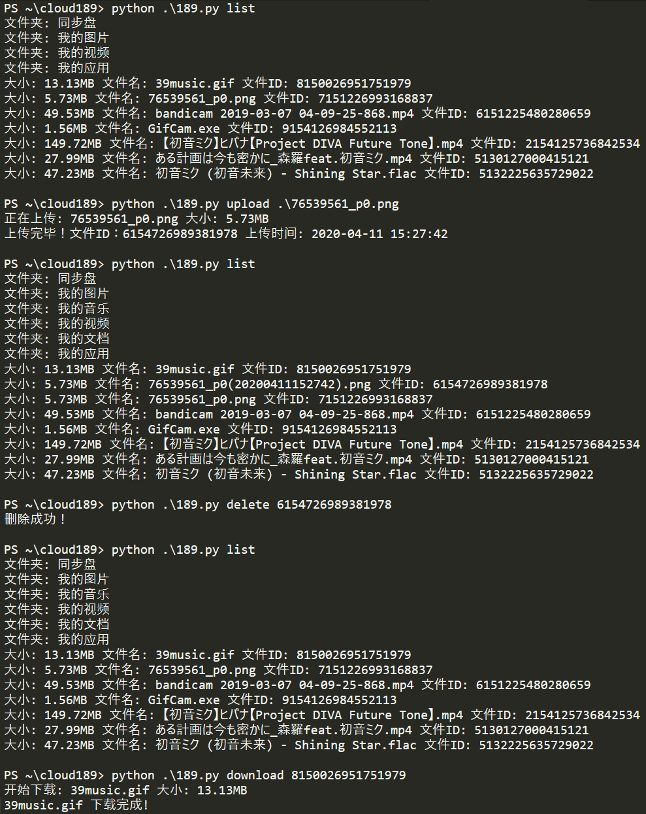

# Cloud189 CLI

### 一：准备
1. Python 版本 >= 3.6
2. 安装依赖
~~~shell
pip install -r requirements.txt
~~~
3. 配置
打开``189.py``, 找到以下两行  
~~~python
username = ""
password = ""
~~~
修改为自己的天翼云盘手机号和密码即可  
### 二：使用
1. 查看**根目录**的文件  
~~~shell
python 189.py list
~~~  
2. 上传文件至**根目录**  
~~~shell
python 189.py upload 文件
~~~  
3. 下载**根目录**的文件  
~~~shell
python 189.py download 文件ID # 文件ID 第一步看
~~~  
4. 删除**根目录**的文件  
~~~shell
python 189.py delete 文件ID # 文件ID 第一步看
~~~

### 三：免责
您使用本工具做的任何事情都雨我无瓜。
